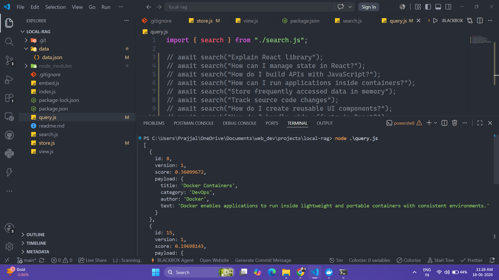

# 🔍 Local Semantic Search Engine


A local semantic search engine built using **Node.js**, **Transformers.js**, **Hugging Face embeddings**, and **Qdrant Vector Database**.

Instead of matching exact keywords, the system retrieves documents based on their semantic meaning using vector embeddings.

```md
# 🔍 Local Semantic Search Engine

## 🏗️ Architecture



<p align="center">
  Semantic Search using Transformers.js, Hugging Face Embeddings and Qdrant
</p>
```

# 🎯 Problem Statement

Traditional search systems rely on exact keyword matching.

For example:

**Query:**

```text
Explain React
```

**Document:**

```text
React is a JavaScript library for building user interfaces.
```

Although both refer to the same concept, the words are not identical. A keyword-based search engine may fail to identify the document as the most relevant result.

The goal of this project is to solve this limitation using **semantic search**.

Instead of comparing words, the system:

1. Converts documents into vector embeddings.
2. Converts user queries into vector embeddings.
3. Measures semantic similarity between vectors.
4. Returns documents that are closest in meaning.

This enables retrieval based on context and intent rather than exact keyword matches.

---

### Example

| Query                       | Traditional Search          | Semantic Search                       |
| --------------------------- | --------------------------- | ------------------------------------- |
| Explain React               | May miss relevant documents | ✅ Finds React-related content        |
| What is a frontend library? | Often fails                 | ✅ Retrieves React document           |
| JavaScript UI framework     | Keyword dependent           | ✅ Finds semantically similar content |

By leveraging Hugging Face embeddings and Qdrant Vector Database, this project demonstrates how modern AI-powered retrieval systems can understand meaning rather than just text matching.

---

# 🚀 Features

- ✅ Local Embedding Generation
- ✅ Semantic Search
- ✅ Vector Database Storage
- ✅ Dockerized Qdrant Setup
- ✅ No External AI APIs
- ✅ Fully Local Execution

---

# 🛠️ Tech Stack

| Technology                    | Purpose                     |
| ----------------------------- | --------------------------- |
| Node.js                       | Application Runtime         |
| Transformers.js               | Local Inference Engine      |
| Hugging Face all-MiniLM-L6-v2 | Embedding Model             |
| Qdrant                        | Vector Database             |
| Docker                        | Qdrant Container Management |

---

# 🏗️ System Architecture

```text
                    ┌─────────────────┐
                    │  data.json      │
                    └────────┬────────┘
                             │
                             ▼
                  ┌────────────────────┐
                  │ Transformers.js    │
                  │ (Embedding Model)  │
                  └────────┬───────────┘
                           │
                           ▼
                ┌──────────────────────┐
                │ Vector Embeddings    │
                │ [0.12, 0.45, ...]    │
                └────────┬─────────────┘
                         │
                         ▼
              ┌─────────────────────────┐
              │ Qdrant Vector Database  │
              │ (Running in Docker)     │
              └────────┬────────────────┘
                       │
                       ▼
                ┌───────────────┐
                │ Similarity    │
                │ Search        │
                └───────┬───────┘
                        │
                        ▼
              ┌─────────────────┐
              │ Relevant Result │
              └─────────────────┘
```

---

# 🔄 Project Flow

## Step 1: Load Documents

The application loads text documents from:

```text
data/data.json
```

Example:

```json
[
  {
    "id": 1,
    "text": "React is a JavaScript library for building user interfaces."
  }
]
```

---

## Step 2: Generate Embeddings

Each document is passed to the Hugging Face embedding model:

```js
const extractor = await pipeline(
  "feature-extraction",
  "Xenova/all-MiniLM-L6-v2",
);
```

The model converts text into numerical vectors:

```text
"What is React?"
```

↓

```text
[0.12, -0.34, 0.88, ...]
```

These vectors capture semantic meaning.

---

## Step 3: Store Embeddings in Qdrant

Generated vectors are stored in Qdrant.

Example:

```json
{
  "id": 1,
  "vector": [...],
  "payload": {
    "text": "React is a JavaScript library..."
  }
}
```

Qdrant enables efficient similarity search across thousands or millions of vectors.

---

## Step 4: Why Docker?

Qdrant is deployed using Docker:

```bash
docker run -p 6333:6333 qdrant/qdrant
```

### Why Docker?

- Isolated environment
- No manual installation of Qdrant
- Easy setup and cleanup
- Consistent behavior across machines
- Production-like deployment

Docker starts a Qdrant container locally and exposes:

```text
http://localhost:6333
```

for API access.

---

## Step 5: Semantic Search

When a user enters a query:

```text
Explain React
```

the query is converted into an embedding vector.

```text
Query
   ↓
Embedding
   ↓
Qdrant Similarity Search
   ↓
Top Matching Documents
```

Example Output:

```json
[
  {
    "id": 1,
    "score": 0.77,
    "payload": {
      "text": "React is a JavaScript library for building user interfaces."
    }
  }
]
```

---

# 📂 Project Structure

```text
local-rag/
│
├── data/
│   └── docs.json
│
├── embed.js
├── store.js
├── search.js
├── query.js
├── view.js
├── index.js
└── package.json
```

---

# ⚡ Installation

## Clone Repository

```bash
git clone <repository-url>
cd local-rag
```

## Install Dependencies

```bash
npm install
```

## Start Qdrant

```bash
docker run -p 6333:6333 qdrant/qdrant
```

## Store Documents

```bash
node index.js
```

## Run Search

```bash
node query.js
```

---

# 🎯 Key Concepts Implemented

- Vector Embeddings
- Semantic Search
- Similarity Matching
- Vector Databases
- Information Retrieval
- Dockerized Services

---

# 📌 Current Status

### Completed

- ✅ Document Ingestion
- ✅ Embedding Generation
- ✅ Qdrant Integration
- ✅ Vector Storage
- ✅ Semantic Search

### Planned

- ⏳ PDF Parsing
- ⏳ Text Chunking
- ⏳ Metadata Filtering
- ⏳ Retrieval-Augmented Generation (RAG)

---

# 📜 License

MIT License
